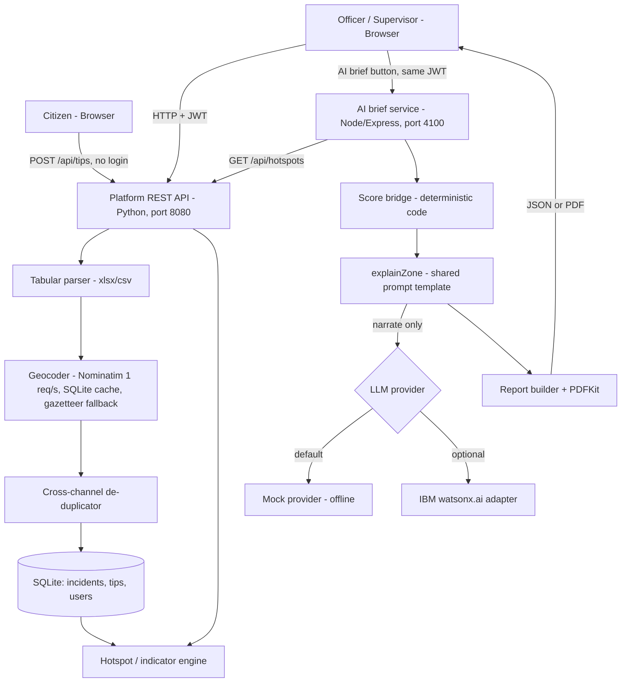

# Architecture

## System Architecture

## Components

| Component | Technology | Responsibility |
|---|---|---|
| Dashboard / tip portal | HTML, CSS, vanilla JS, Leaflet | Map + table with unified filters, upload with live preview, anonymous tip portal, tip review |
| Platform REST API | Python `http.server` (threaded) | Auth, upload, tips, hotspots, structured reports |
| Ingestion core | Python (`core/`) | Column detection, category normalisation, row flagging, geocoding, de-duplication |
| Indicator engine | Python | Frequency + trend per district/category; weighted-composite report ranking |
| Storage | SQLite | Incidents, tips, users, geocode cache |
| AI brief service | Node.js, Express | Fetch hotspots, derive score/factors, narrate, build JSON/PDF briefs |
| LLM provider | Mock (default) / watsonx.ai adapter | Produce a rationale + recommended action for a score it is *given* |

## Data Flow

1. An officer uploads a spreadsheet to `POST /api/upload` (JWT required).
2. Rows are parsed against the domain config; unmappable rows go to `flagged_rows` with a reason.
3. Valid rows are geocoded (cache first, then Nominatim at ≤1 req/s, then gazetteer), then de-duplicated across channels, then stored in SQLite.
4. `GET /api/hotspots` computes frequency per district and category for the domain's window, plus previous-window count and trend. Verified tips are included.
5. Citizens post tips to `POST /api/tips` (no auth, per-IP rate limit). Officers list them and call `PATCH /api/tips/:id/verify`.
6. When an officer clicks an AI brief button, the browser calls the AI brief service with the officer's existing JWT. The service calls the platform's `/api/hotspots`, groups by district, derives `score` (district total scaled 0-100 against the busiest district) and `factors` (each category's share), then asks the LLM to narrate them. The bucket (`high` ≥70, `medium` ≥40, else `low`) is computed in code and passed to the LLM as fixed fact.
7. The brief is returned as JSON (rendered in a new tab) or as a PDF.

## Security Considerations

- Officer routes require a JWT (HS256, 24 h). The AI brief service verifies the same token, so `JWT_SECRET` must match on both services; it is read from the environment, with a dev-only fallback in the platform.
- The tip record stores no client IP or personal data. The rate limiter holds the IP in process memory only.
- The prompt instructs the model never to alter scores, and the code never asks it for one.
- **Known gaps:** CAPTCHA is checked client-side only; tip priority/urgency flags are client-supplied; passwords are unsalted SHA-256; traffic is HTTP. Suitable for a hackathon prototype, not for production.

## Scalability Notes

The platform uses SQLite and an in-memory rate limiter, so it is single-node. Moving to PostgreSQL/PostGIS, a shared rate-limit store, and a job queue for geocoding would allow horizontal scaling; the AI brief service is stateless and can be scaled independently (LLM latency is its bottleneck, so batching or caching briefs per window is the obvious next step).
